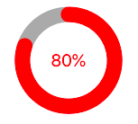

# WSLoader

A configurable fancy circular progress loader. Issues are welcome!

[中文版](https://github.com/CoooooooderJ/WSLoader/blob/master/README.md)


## I. Effects


```Low version```


```High version```


## II. Environment
swift version 5.1

iOS version 11.0+ （Other versions are not tested. The code doesn't contain API that lower iOS version doesn't support, so iOS 7+ should be compatible.）


## III. Usage
1. Simply use the WSLoader.swift source file（Pod or cathage is not supported for now, but both are on the todo list）
2. Pass frame and style when initializing, and use WSLoader as any system UIView.
   ```swift
        let frame = CGRect(x: (view.frame.width - 150)/2, y: 100, width: 150, height: 150)
        loader = WSLoader(frame: frame, style: .excutable)
        view.addSubview(loader)
        loader.value = 0.2
   ```
   When passing frame to the initializer, whatever height will be ok, for the loader will always be a square and only infers to the width of it's frame parameter.
3. 4 styles
    * none
  
        
    * label

        
    * bilabel

        
    * excutable

        The Effect is as the two gifs above. By assigning to closure **playAction** and closure **pauseAction**, you can make the loader operatable. In this style, when the **loader.value** comes to 1.0, the style would automatically change to .label
4. When use the style of .excutable, pngs with name "play" and "pause" should be included in the assets. Use your own piece of assets.
5. High version WSLoader config code
    ```swift
        let frame = CGRect(x: (view.frame.width - 150)/2, y: 100, width: 150, height: 150)
        loader = WSLoader(frame: frame, style: .excutable)
        view.addSubview(loader)
        
        loader.textColor = .red
        loader.textFont = .systemFont(ofSize: 28)
        loader.trackWidth = 25

        loader.buttonTintColor = .red
        loader.isPulsing = true
        loader.pulsingScale = 1.4
        loader.pulsingDuration = 1.6
        loader.stopPulsingWhenFinish = true
        
        loader.pauseAction = { atPercentage in
            /*
            self.task.cancel { (data) in
                if data != nil {
                    self.resumeData = data!
                    self.task = nil
                    print("stop at \(data!.count)")
                }
            }
            */
        }
        
        loader.playAction = { atPercentage in
            /*
            if self.resumeData != nil {
                self.task = self.session.downloadTask(withResumeData: self.resumeData!)
            } else {
                let url = URL(string: "https://images.pexels.com/photos/2939337/pexels-photo-2939337.jpeg")
                self.task = self.session.downloadTask(with: url!)
            }
            self.task.resume()
            self.resumeData = nil
            */
        }
    ```

## IV. LICENSE - [MIT](LICENSE.md)


## V. Notice
# IMAGE LINK, OR IMAGES CONTAINED IN THE EFFECT PART, ARE FROM PEXELS.COM. CONTACT ME IN CASE OF INVASION AND DELETION. 


## VI. Buy me a coffee if this repo is of some use ;-)
 paypal： https://www.paypal.me/coooooooderj

 wechat tips：   


## VII. Contact Me
 myjawdrops

 894318488

 myjawdrops@gmail.com
